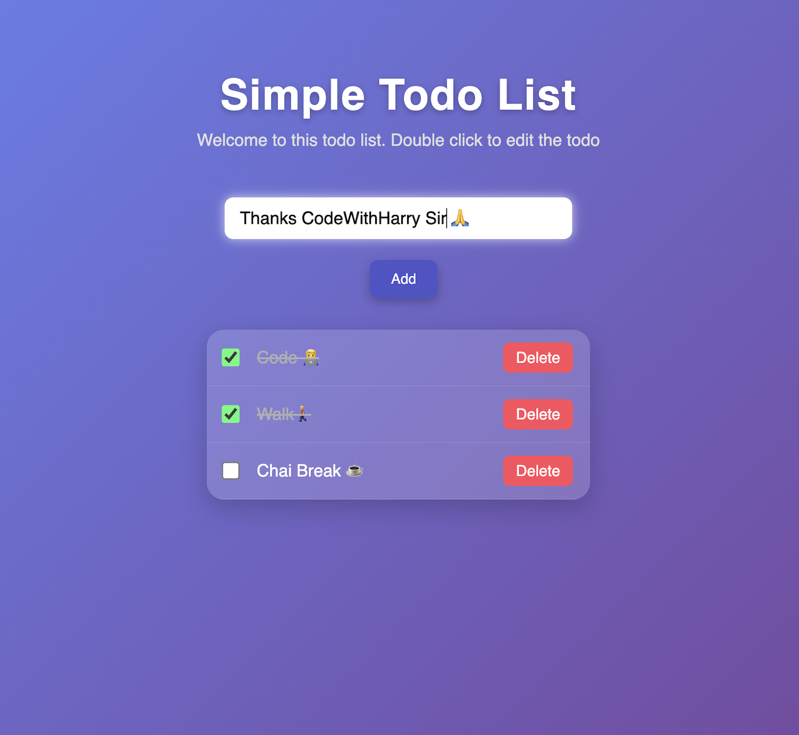

  

#  To-Do List App

A simple and elegant **To-Do List App** built using **HTML, CSS, and JavaScript** — a part of my *Back to Basics* web development practice project inspired by **CodeWithHarry Sir**.

---

##  Project Overview

This project helps manage daily tasks efficiently — you can **add**, **delete**, and **mark tasks as completed**.  
It’s a great hands-on way to strengthen **DOM manipulation**, **event handling**, and **localStorage** concepts in JavaScript.

---

##  Tech Stack

- **HTML5** – structure of the app  
- **CSS3** – styling and layout  
- **JavaScript (ES6)** – functionality and interactivity  

---

##  Features

-  Add new tasks  
-  Mark tasks as done  
-  Delete tasks  
-  Save tasks in localStorage (persistent data)  
-  Clean and responsive UI  

---

## 📚 What I Learned

- Working with the **DOM (Document Object Model)**  
- Using **localStorage** for data persistence  
- Handling **click events and input validation**  
- Writing clean, beginner-friendly **JavaScript logic**  

---

## 🙏 Credits

Project practiced and inspired by **CodeWithHarry Sir’s “To-Do List App” tutorial** on YouTube.  
Part of my **Back to Basics Web Development journey**.  

---

## 📸 Preview

  

---

Building web dev skills one project at a time! Big thanks to CodeWithHarry for the Todo List App tutorial — HTML, CSS & JS, back to basics done right. 🚀

